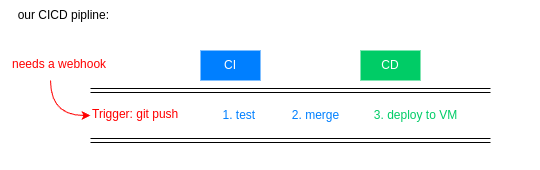
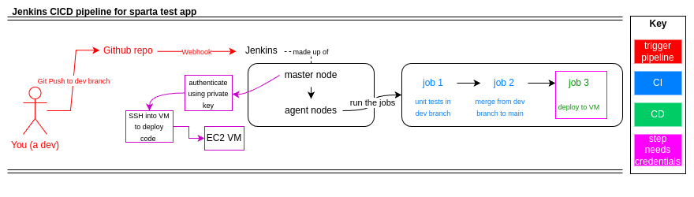
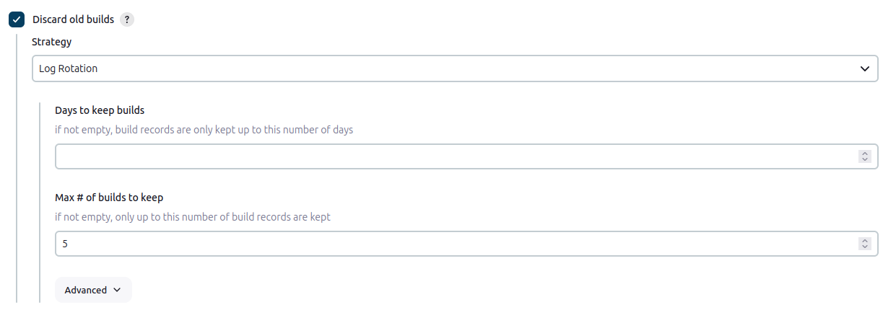
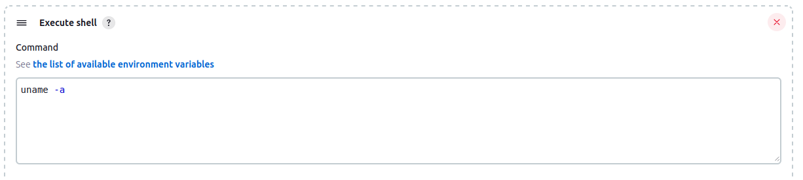
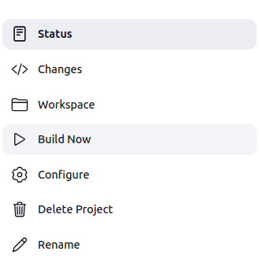

# CICD pipeline

- [CICD pipeline](#cicd-pipeline)
  - [Our pipline](#our-pipline)
    - [basic outline](#basic-outline)
    - [more detail](#more-detail)
  - [Why build a pipeline?](#why-build-a-pipeline)
  - [Why jenkins?](#why-jenkins)
  - [code along - using jenkins](#code-along---using-jenkins)
  - [creating a multi-stage pipeline code along](#creating-a-multi-stage-pipeline-code-along)
    - [addition to notes](#addition-to-notes)
    - [continous delivery vs continuous deployment](#continous-delivery-vs-continuous-deployment)
      - [Key differences:](#key-differences)

## Our pipline 
### basic outline 

### more detail 

## Why build a pipeline? 
* making devs life easier 
* quickly get changes to end users 
* reduce risk of big code changes messing up our code base 
* **business value** save time, saves money, users benefit quickly 

## Why jenkins? 
* free
* has powerful plugins 
* great to help understand the CICD pipeline 

## code along - using jenkins 
1. aws instances - start servers (ramon will do every day we are using, we are now using much bigger servers than previously on azure)
2. Group split between server 1 (http://34.254.6.118:8080) and server 2 ( http://52.31.15.176:8080) 
    * I'm in group 1 
3. login, using stored login + pw 
4. add new item to create new pipeline
   * [jenkins-add-build](README.md)
5. build settings: 
   * under configure > general 
   * select to only store the most reacent 5 builds (can change depending on needs) 
   * 
6. add build step - execute shell 
   * 
   * for this example we have run `uname -a` which displays the name of the operating system 
7. click ok 
8. build now 
   
9. check output 

## creating a multi-stage pipeline code along 
* can link jobs to create a muti-stage pipeline 

1. go to job 1 
2. configure > post build actions 

### addition to notes
* is jenkins just for cicd pielines? 

### continous delivery vs continuous deployment
Continuous delivery automates the software release process up to the point of a production environment, requiring a manual approval to deploy to live production, while continuous deployment fully automates the entire process, deploying every change to production automatically without manual intervention; essentially, continuous delivery is a stepping stone to the more aggressive continuous deployment approach where every successful build is automatically released to production. 
 

#### Key differences: 
**Manual approval:**  
* Continuous delivery includes a manual approval step before deploying to production, whereas continuous deployment does not.
**Risk level:**  
* Continuous deployment carries a higher risk of deploying potentially unstable code to production due to its fully automated nature, while continuous delivery provides a safety net with manual review. 
**When to use each:**  
**Continuous delivery:**  
* Suitable for applications where a higher level of control is needed before deploying to production, such as highly regulated industries or critical systems. 
**Continuous deployment:**  
* Ideal for applications with robust automated testing and monitoring where rapid iteration and frequent releases are desired. 