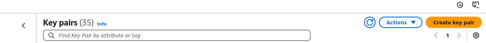
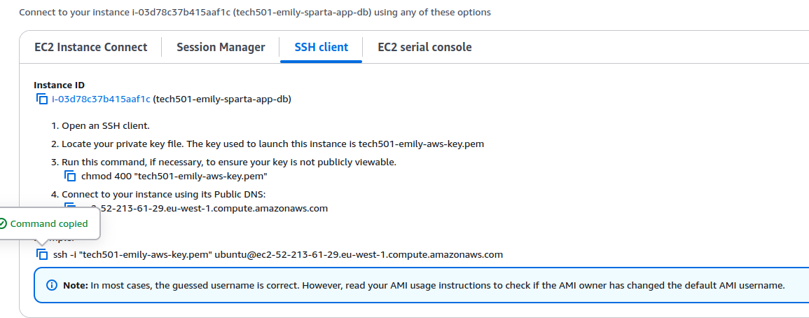
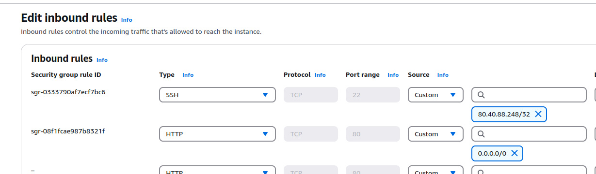
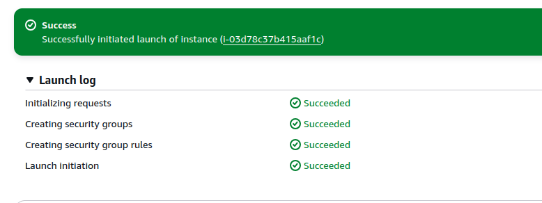
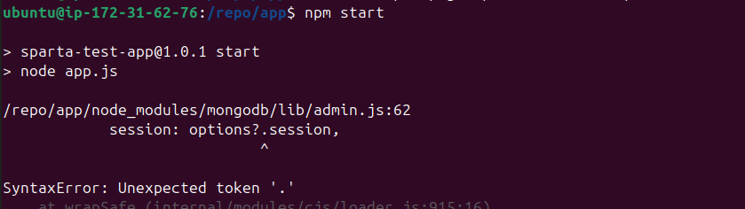

# Deploying a 2 teir arcitecture using AWS 

- [Deploying a 2 teir arcitecture using AWS](#deploying-a-2-teir-arcitecture-using-aws)
  - [task overview](#task-overview)
  - [creation of new ssh key for AWS](#creation-of-new-ssh-key-for-aws)
  - [Creation of database VM / App VM in AWS](#creation-of-database-vm--app-vm-in-aws)
    - [settings as follows:](#settings-as-follows)
      - [inbound rules for app VM](#inbound-rules-for-app-vm)
      - [inbound rules for db VM](#inbound-rules-for-db-vm)
  - [command line set-up steps](#command-line-set-up-steps)
    - [database VM](#database-vm)
    - [app VM](#app-vm)
      - [copy sparta app to vm:](#copy-sparta-app-to-vm)
      - [installations on app VM](#installations-on-app-vm)


## task overview
```
Reason for this task: Consolidation of what you've done, show how fast you can deploy the app using your scripts

    Use your scripts to deploy the database + app (with the reverse proxy working)
        Use VM size: t2.micro for both your VMs
        Use the default VPC
        Use the naming convention
    Post link to /posts page as soon as you get it working - once you get the thumbs up, you can stop the VMs when you are ready (i.e. before you go to lunch as normal)
    Document anything new you learnt to get the /posts page as quickly as possible, especially any blockers you had and how you overcame them
    Post link to documentation around COB
``` 

## creation of new ssh key for AWS 
* used create key button

* downloaded from aws and stored in my local .ssh folder 

* Could also do via command line as with azure, but nice to have a built in option

## Creation of database VM / App VM in AWS

Change region to ireland! 

--- 
### settings as follows:

* name as usual 
* Ubuntu 22.04 LTS
* t3.micro
* stick to defaults for virtual network and subnets (via edit button on side of box) 

* ended up changing the security groups after launching, as could not find them initially, however they were easy to edit from the instance main page under security 
<br>

#### inbound rules for app VM


  * Make sure ssh (port 22) is allowed in sg.
  * Also need port 27017 (mongodb) allowed.
  * unlike in azure you need to allow access between machines in the same subnet explicitly, as it is not a default in aws 

#### inbound rules for db VM
* need to check! 

---

successful set-up looks like this: 


## command line set-up steps 

### database VM
* worked as per previous notes 

### app VM 

#### copy sparta app to vm: 
```
scp -i ~/.ssh/tech501-emily-aws-key.pem -r nodejs20-sparta-test-app ubuntu@ec2-54-74-135-124.eu-west-1.compute.amazonaws.com:/home/ubuntu
```
* after this `mv nodejs20-sparta-test-app /repo` will move from home to root + rename folder to repo

#### installations on app VM  

* ran into some errors here

* the errors were related to the running of the app, specifically the version of node

Think the error was specifically to do with my installing of node (should have used the code below): 
```
app installing node
sudo DEBIAN_FRONTEND=noninteractive bash -c "curl -fsSL https://deb.nodesource.com/setup_20.x | bash -" && \
sudo DEBIAN_FRONTEND=noninteractive apt-get install -y nodejs
``` 