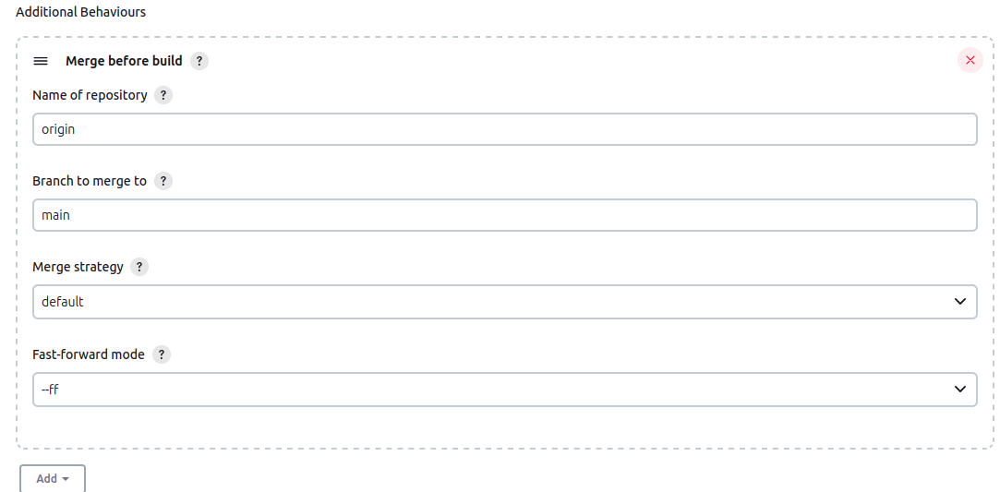
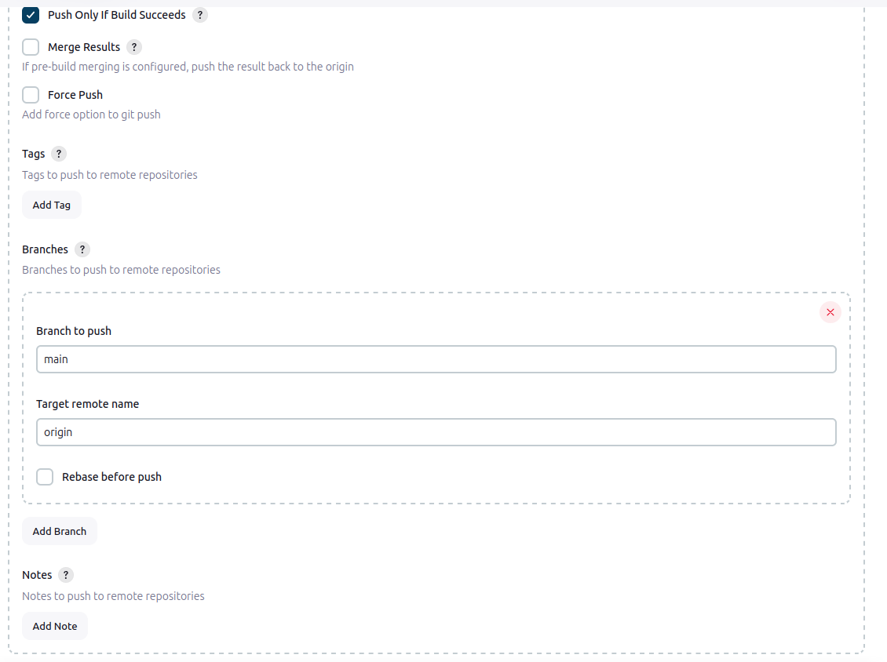
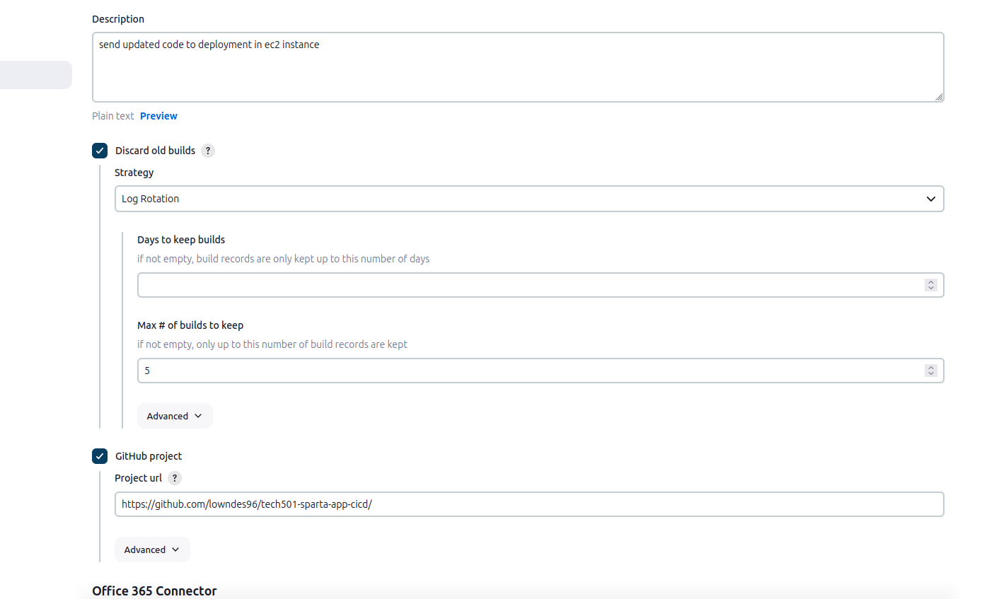
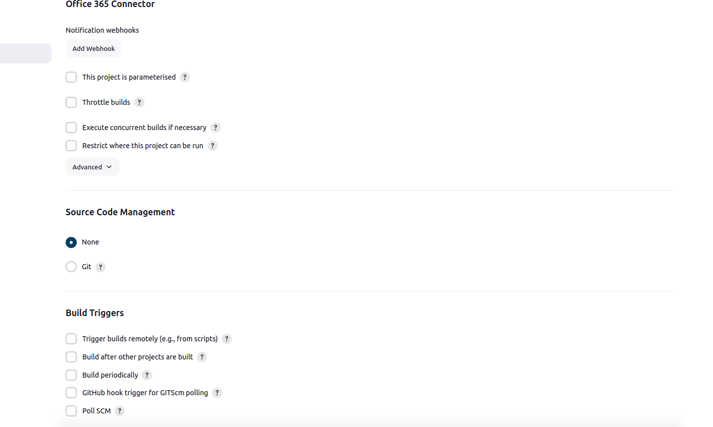
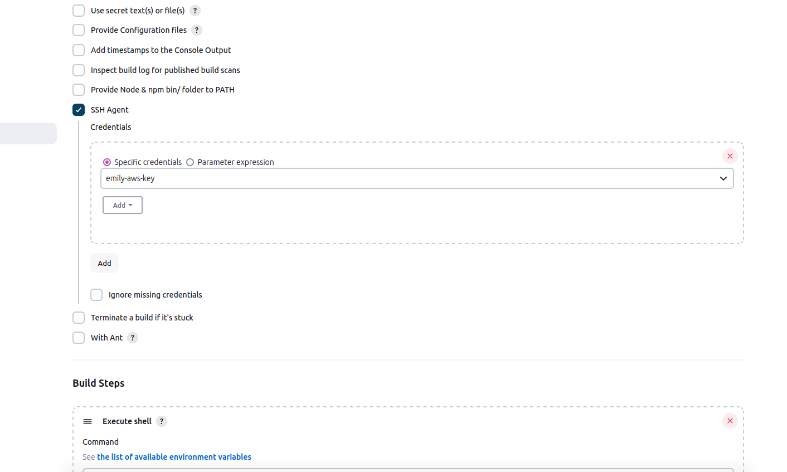

# jenkins pipeline 

- [jenkins pipeline](#jenkins-pipeline)
- [task instructions:](#task-instructions)
  - [Job 1 set up](#job-1-set-up)
    - [setting up access to github via ssh keys](#setting-up-access-to-github-via-ssh-keys)
      - [In github:](#in-github)
      - [In jenkins:](#in-jenkins)
    - [setting up the webhook](#setting-up-the-webhook)
    - [dev branch set up](#dev-branch-set-up)
      - [on command line](#on-command-line)
      - [on jenkins](#on-jenkins)
    - [other jenkins set-up](#other-jenkins-set-up)
  - [Job 2 set up](#job-2-set-up)
    - [way 1: execute shell](#way-1-execute-shell)
      - [job 2 working](#job-2-working)
    - [way 2: using jenkins plugins](#way-2-using-jenkins-plugins)
  - [Job 3 set up](#job-3-set-up)
    - [Shell Script:](#shell-script)
      - [Command to move the app stored within jenkins (tested) to the VM home directory](#command-to-move-the-app-stored-within-jenkins-tested-to-the-vm-home-directory)
        - [ssh into machine and carrys out indented commands](#ssh-into-machine-and-carrys-out-indented-commands)
      - [shell script to verify](#shell-script-to-verify)
- [Questions - ask or test with code](#questions---ask-or-test-with-code)


# task instructions: 

```
Pre-requisites: You already have: 

    Job 1 <yourname>-job1-ci-test working 

Steps: 

    Get Job 2 working: 
        Name Job 2: similar to <yourname>-job2-ci-merge 
        Create a dev branch on your local git repo sparta-test-app-cicd 
        Make a change to dev branch and push the code to GitHub - the webhook needs to trigger the pipeline 
        If the tests pass on Job 1, Job 2 should run (and the code should merge from dev to main branch) 
    Get Job 3 working: 
        Name Job 3: similar to <yourname>-job3-cd-deploy 
        Copy the updated & tested code from Jenkins to the AWS EC2 instance 
        Jenkins will need to SSH into the EC2 instance to update the code & re-run the app 
        Each person will need to add the key/SSH credentials/pem file on Jenkins for Job 3 to access your EC2 instance (unless everyone is using the same key pair for their EC2 instances - in this case only one person needs to add the private key on Jenkins) 
        To copy the code from Jenkins to to EC2, use the scp or rsync commands from Jenkins 
            DO NOT: git clone from main branch and push to production 
        You will need an EC2 instance already running 
            Should use normal image you need to run the app. Examples: 
                For the Sparta test app using Node JS 20, you will need Ubuntu 22.04 LTS 
                For the Sparta test app using Node JS 12, you will need Ubuntu 18.04 LTS 
                For the Java 17 "World" API, you will need Ubuntu 22.04 LTS 
            Use normal SG rules, but allow Jenkin's IP to SSH in 
            Must have all dependencies installed to run your app 
    Document with: 
        important screenshots (especially homepage updated via CICD pipeline) 
        diagram to explain your CICD pipeline 
        paste link to documentation around COB 
``` 


## Job 1 set up 

### setting up access to github via ssh keys

#### In github:

* within the repository, go to settings and click on deploy keys
* add the public key created for this task into the repo
#### In jenkins:
* under source code management tick git
* add the repo 

* add private key here

### setting up the webhook 


### dev branch set up 

#### on command line

#### on jenkins

### other jenkins set-up 
* github project needs to jave the project https url, with a `/` at the end - jenkins is fussy!

**Build Environment**

**Build steps**
* execute shell
```
cd app
npm install 
npm test
``` 


## Job 2 set up 
### way 1: execute shell 

* need to enable the ssh plugin 

Build step (shell):
```
git checkout main
git pull origin main
git merge --ff-only origin/dev
git push origin main
``` 
#### job 2 working


### way 2: using jenkins plugins 
* under source control > git > add > additional behaviours 
* this is to update main branch to what is in github, to cover instances of multiple updates at the same time 
* setup: 
  * name of repo = origin (default name) 
  * branch to merge to = main 
  * default merge stratagey 
  * fastforward mode (ff) - only adds new updates to main 

* post build step of github action > push only if build suceeds, pushes changes from the dev branch to main 

* only want updates to occur if the merge to main above happened correctly. 
* there are no 'main build' steps here, as the pre and post build functionality are able to complete this job alone
## Job 3 set up 
* use of usual disgard old builds and github project steup (github may be uneccisary here? - check)

* dont need any source code management of the github here - all done in previous steps 

* under build env - need to add the ssh key to access the aws vm 



### Shell Script: 
* as aws was used the public ip will change each time a new instance is started - could declare a public IP variable at the top to make changing this easier 
#### Command to move the app stored within jenkins (tested) to the VM home directory
* used scp command to move files from job-2 (merge) into the VM 
* key does not need to be included in command as it is already an enviromnment variable being used 

```
scp -o StrictHostKeyChecking=no -r /var/jenkins/workspace/emily-job1-ci-merge/app/ ubuntu@ec2-3-253-101-19.eu-west-1.compute.amazonaws.com:/home/ubuntu
``` 
##### ssh into machine and carrys out indented commands 
```
scp -o StrictHostKeyChecking=no -r /var/jenkins/workspace/emily-job1-ci-merge/app/ ubuntu@ec2-3-253-255-127.eu-west-1.compute.amazonaws.com:/home/ubuntu
ssh ec2-3-253-255-127.eu-west-1.compute.amazonaws.com << 'EOF'
  # Delete previous directory
  sudo rm -rf /repo/app
  # Move the app directory
  sudo mv /home/ubuntu/app /repo/app
  # Restart Nginx
  sudo systemctl restart nginx
  echo 'nginx restarted'
  #move to app folder 
  cd /repo/app
  echo 'in app folder'
  # start app
  npm install  
  pm2 start app.js 

EOF 
``` 
#### shell script to verify 
* eliminate last few lines of code - are they neccisary - not sure? 
* try moving app directly to root in original command (may be a permissions issue)
* learn more about the 'EOF' script format [EOF explanation](https://kodekloud.com/blog/eof-bash/)

# Questions - ask or test with code
* job 1/2 - where are those shell commands happening, is it 'in' the github or on a copy moved into jenkins server??
* can I just copy across updated files directly to root? 
* can make an alias
```
function gitk() {
        if [ -z "$1" ]; then
        echo "Please provide a commit message."
        return 1
    fi
    git add .
    git commit -m "$1"
    git push
}
``` 