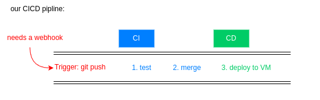

# Creating a jenkins server (17th feb)

Instructions: 
```
    DO NOT create an agent node (use the built-in node only)
        Your servers were set to spin up agent nodes to run the jobs because the whole group was using it
    Re-build the pipeline in your own Jenkins

Steps:

    Create new repo CICD-with-own-Jenkins-project for the documentation of this task
    Build your own Jenkins server
        Use Ubuntu 22.04 LTS
        Size:
            For Sparta test app using Node JS 20: Use t3.micro size
            For Java 17 app using a MySQL database e.g. the "World" API: use t3.small (since compiling this app requires more than 1 GB of memory)
        Launch it in your own VPC (1 subnet)
    Rebuild your Jenkins pipeline up to the deployment of the app
    Record a record 5-7min video:
        How to build Jenkins
        How to build environment
        How did you rebuild the pipeline
    Include your markdowns that you have made today in the new repo, and create a new markdown documenting how you have created Jenkins with the required environments. Make sure to include two diagrams:
        Jenkins pipeline diagram
        General diagram about the process
    Hand-in everything you've done around COB

``` 
# Basic set-up  
* create a VM on aws the instructions above 
  * used a t3.small size 
  * Ubantu 22.04 LTS
  * previous key pair

# Installs to the VM

[jenkins instilation instructions](https://www.jenkins.io/doc/book/installing/linux/ )

* ssh into your vm 
* install java 

    ```linux
    sudo apt update
    sudo apt install fontconfig openjdk-17-jre
    java -version
    ```
    output should look like: <br>
    

* download LTS version of jenkins and install 
  ```
  sudo wget -O /usr/share/keyrings/jenkins-keyring.asc \
  https://pkg.jenkins.io/debian-stable/jenkins.io-2023.key
    echo "deb [signed-by=/usr/share/keyrings/jenkins-keyring.asc]" \
  https://pkg.jenkins.io/debian-stable binary/ | sudo tee \
  /etc/apt/sources.list.d/jenkins.list > /dev/null
    sudo apt-get update
    sudo apt-get install jenkins
    ``` 
* switch the jenkins service on 
    ```
    # start jenkins service
    sudo systemctl start jenkins.service

    # Check status of jenkins (should be running)
    sudo systemctl status jenkins
    ```
* add port 8080 as an inboard rule to the VM 
* check jenkins is running on port 8080 and access the jenkins instance via public IP:8080
    ```
    ps -ef | grep jenkins
    ``` 
    
* unlock Jenkins as prompted using `sudp cat file-location` <br>
    
* install sugested plugins and make an admin account <br>
  
* additional plugins to install 
    * navigate to magange jenkins page and choose plugins (nodejs, shh agent)
    * 
    * 
    * 
  * specific node versions can be installed via your we abdress with the addition of `configure-tools`

## Overview diagrams 

