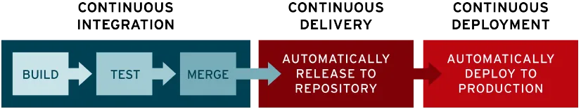

## Contents
- [What is CI? Benefits?](#what-is-ci-benefits)
  - 
- [What is CD? Benefits?](#what-is-cd-benefits)
- [Difference between CD and CDE](#difference-between-cd-and-cde)
      - [Key differences:](#key-differences)
- [What is Jenkins?](#what-is-jenkins)
- [Why use Jenkins? Benefits of using Jenkins? Disadvantages?](#why-use-jenkins-benefits-of-using-jenkins-disadvantages)
- [Stages of Jenkins](#stages-of-jenkins)
- [What alternatives are there for Jenkins](#what-alternatives-are-there-for-jenkins)
- [Why build a pipeline? Business value?](#why-build-a-pipeline-business-value)
- [Create a general diagram of CICD](#create-a-general-diagram-of-cicd)
- [Understand SDLC workflow: plan, design, develop, deploy](#understand-sdlc-workflow-plan-design-develop-deploy)
    - [sources:](#sources)

# What is CI? Benefits?

- CI stands for **continuous intergration** and is the practice of automating and frequently intergrating code changes into a shared source code repository 
 
--- 
Aim: 

- streamline and accelerate th esoftware development lifecycle 
 
benefits: 

- helps organizations avoid bugs and code failures (easyer to pinpoint bugs - visability of code, and addition in small chunks)
- as updates are made, automated testing steps are triggered to ensure the reliability of merged code change (avoids working in isolation, avoids 'merge day')
- features of CI/CD can help decrease complexity (small steps implemented one at a time)
- automates the manual human intervention traditionally needed to get new code from a commit into production, downtime is minimized and code releases happen faster

# What is CD? Benefits?

- CD stands for **continuous delivery** 
- Continuous delivery usually means a developer’s changes to an application are automatically bug tested and uploaded to a repository (github or container)

# Difference between CD and CDE
* CD = continuous delivery 
* CDE = continuous deployment 

Continuous delivery automates the software release process up to the point of a production environment, requiring a manual approval to deploy to live production, while continuous deployment fully automates the entire process, deploying every change to production automatically without manual intervention; essentially, continuous delivery is a stepping stone to the more aggressive continuous deployment approach where every successful build is automatically released to production. 
 

#### Key differences: 
**Manual approval:**  
* Continuous delivery includes a manual approval step before deploying to production, whereas continuous deployment does not.
**Risk level:**  
* Continuous deployment carries a higher risk of deploying potentially unstable code to production due to its fully automated nature, while continuous delivery provides a safety net with manual review. 
**When to use each:**  
**Continuous delivery:**  
* Suitable for applications where a higher level of control is needed before deploying to production, such as highly regulated industries or critical systems. 
**Continuous deployment:**  
* Ideal for applications with robust automated testing and monitoring where rapid iteration and frequent releases are desired. 

# What is Jenkins?
# Why use Jenkins? Benefits of using Jenkins? Disadvantages?
# Stages of Jenkins
# What alternatives are there for Jenkins
# Why build a pipeline? Business value?
# Create a general diagram of CICD
# Understand SDLC workflow: plan, design, develop, deploy

### sources: 

1. https://www.redhat.com/en/topics/devops/what-is-ci-cd (accessed 4.02.2025)